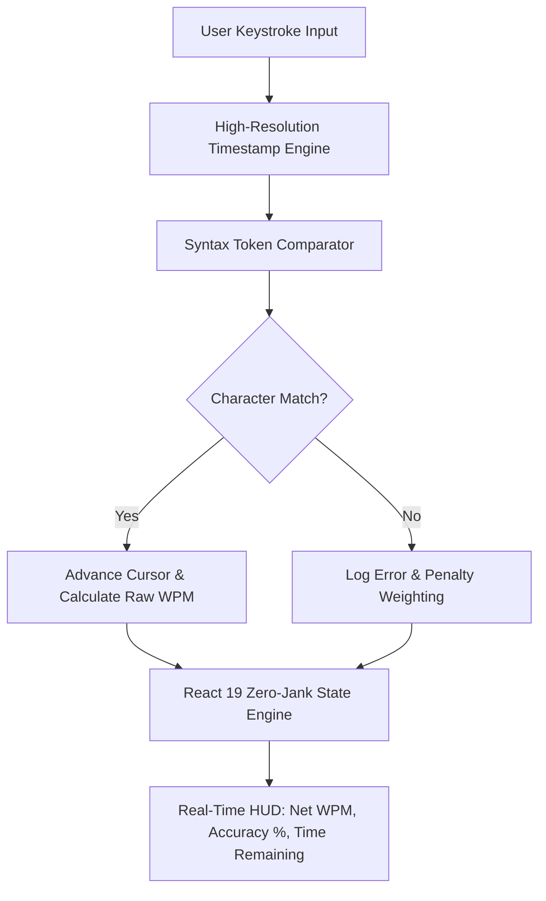

# 🏎️ CodeRacer — Real-Time Developer Typing & Performance Engine

<div align="center">

[](https://react.dev/)
[](https://www.typescriptlang.org/)
[](https://tailwindcss.com/)
[](https://vitejs.dev/)
[](LICENSE)

<p align="center">
  <strong>A high-precision, low-latency typing and code-execution challenge platform built for software developers.</strong><br>
  Engineered with high-resolution event loop timers, syntax token parsing, instant accuracy benchmarking, and modern React 19 architecture.
</p>

</div>

---

## 📌 Architectural Overview

Most typing platforms focus strictly on natural language text, ignoring the complex keystrokes, syntax rules, and bracket pairings required in real-world programming. **CodeRacer** is purpose-built to simulate real developer workflows under time pressure.



---

## ⚡ Key Engineering Highlights

- **High-Precision Metric Computation:** Calculates Net WPM (Words Per Minute), Gross WPM, Accuracy %, and Character-Level Error Penalties using high-resolution timestamps.
- **Zero-Jank State Optimization:** Built with React 19 and Vite 8 to guarantee 60+ FPS rendering during rapid keystroke bursts (120+ WPM).
- **Modern Styling with Tailwind CSS v4:** Utilizes the new CSS-first Tailwind configuration engine with zero runtime overhead.
- **Resilient Type Safety:** Fully typed interfaces with strict TypeScript compilation.

---

## 🛠️ Tech Stack

| Layer | Technologies |
| :--- | :--- |
| **Frontend UI** | React 19, TypeScript, Tailwind CSS v4 |
| **Build & Tooling** | Vite 8, ESLint 9 |
| **Routing** | React Router DOM v7 |
| **State Management** | React Hooks, High-Resolution Event Loop Timers |

---

## 🚀 Quick Start & Local Setup

### Prerequisites
- Node.js >= 18.0.0
- npm / pnpm / yarn

### Installation

```bash
# 1. Clone the repository
git clone https://github.com/adarshbam/coderacer.git
cd coderacer/Frontend

# 2. Install dependencies
npm install

# 3. Start local development server
npm run dev
```

The application will be running at `http://localhost:5173`.

---

## 📄 License
This project is open-source and available under the [MIT License](LICENSE).
